## 29/09/2026

### Simulation data: Spectral function parameter variations:
Starting today by examining the spectral function parameter variations done yesterday.
Recapping, a range of values were made on all "initial setup" simulation parameters:

* Prefactor: 5 samples over [0.005, 0.01] 
* Bandwidth: 5 samples over [0.5, 1.5]
* bath size: 5 samples over [100, 500]
* energy scale: 5 samples over [0,2]
* beta: 5 samples over [0,2]
* mu: 5 samples over [0,2]

Whilst keeping the spectral function and simulation time constant:

$$
J(\omega) = f_{pre}\sqrt{1-\frac{\omega}{D}}
$${#eq-circularSpectralFunction} \
$f_{pre}=$ prefactor \
$\omega=$ bath site energies \
$D=$ bandwidth \

$\Delta t=0.1$ \
$t_{maz}=10000$

Since this parameters were varied in isolation, the following default parameter values were used for non varied parameters:

$f_{pre}=0.005$ \
$n=300$ \
$D=1$ \
$\epsilon = 0$ \
$\beta = 1$ \
$\mu = 1$ \

Using these standard values produces a bath and system occupation as in @fig-standardCase.

:::{#fig-standardCase layout-ncol=2}

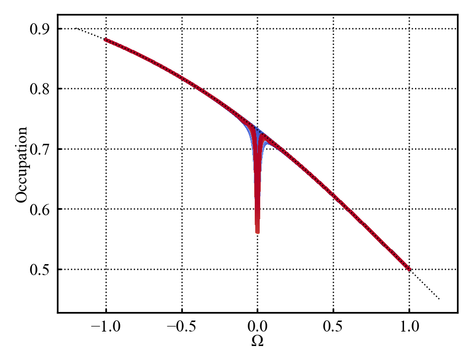{}

{}

Standard case: Bath and system occupations. Note that the bath occupation plot has colour coded lines corresponding to the bath at different moments in time w/blue corresponding to low $t$, red to high $t$. Note that the dotted black line in the bath plot corresponds to the Fermi dirac distribution.
:::

The system occupation in @fig-standardCase demonstrates a thermalization towards $n_{sys} \approx 0.7$, with a sudden dethermalization around $t \approx 950$. The bath occupation plot generally follows a Fermi dirac distribution with a notable decrease centered about $\omega=0$, which presumably corresponds to occupation of the system.

:::{#fig-prefactorVariation layout-ncol=2 layout-nrow=2}

{}

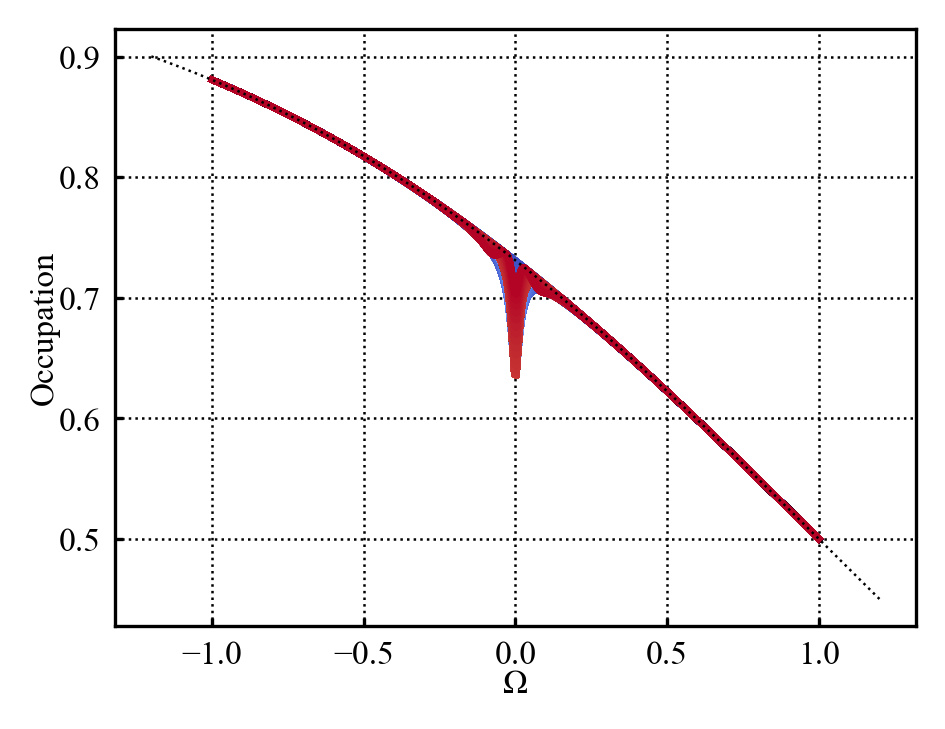{}

{}

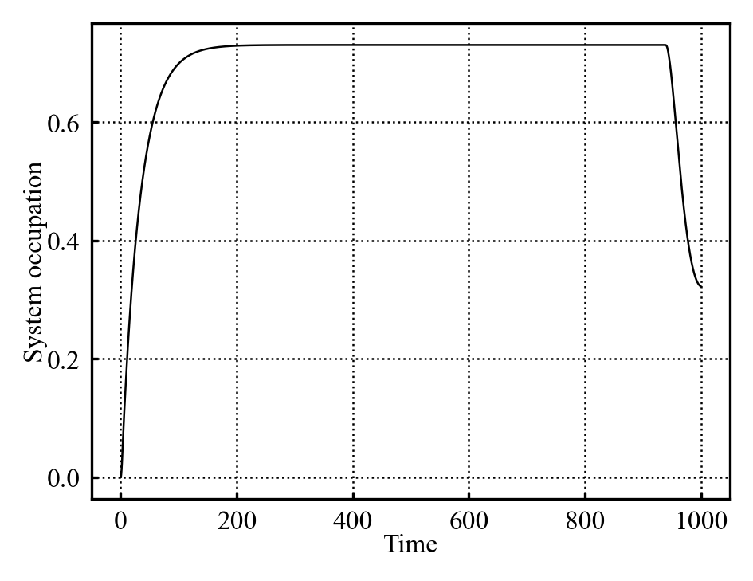{}

Prefactor variation: Bath and system occupations (top and bottom) for $f_{pre}=0.005, 0.01$ (left and right)
:::

Examining @fig-prefactorVariation, there appears to be a narrower/deeper dip in the bath occupation for low $f_{pre}$ and a wider/shallower dip for high $f_{pre}$. The system also seems to thermalize and dethermalize more quickly for high $f_{pre}$ compared to low $f_{pre}$. Both seem to thermalize to the same $n_{sys} \approx 0.7$ value. Given that $f_{pre}$ controls the magnitude of $J(\omega)$ in @eq-circularSpectralFunction, this makes sense. A higher $f_{pre}$ would result in greater coupling between the bath and the system, presumably allowing the system to both thermalize w/the system mor quickly, as well as access a slightly wider range of energies $\Delta\omega$, thus resulting in the apparently wider/shallower dip in the bath occupation for high $f_{pre}$.

:::{#fig-bandwidthVariation layout-ncol=2 layout-nrow=2}

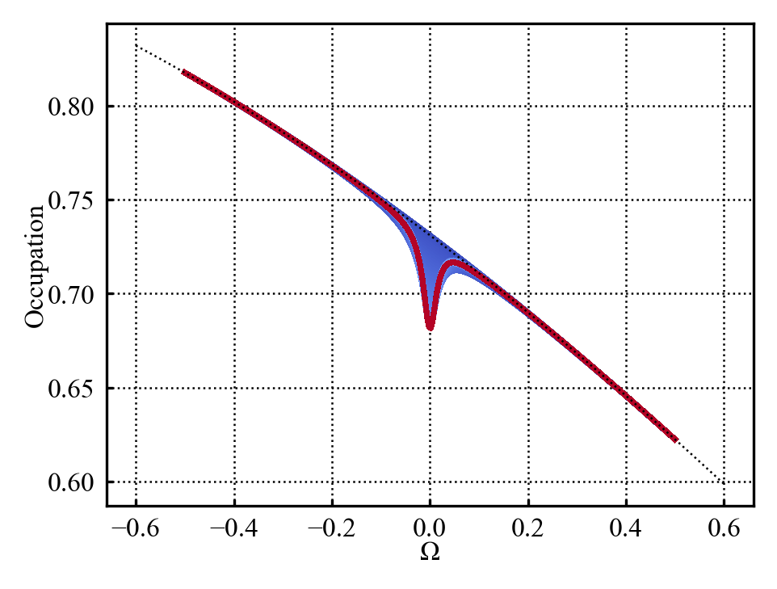{}

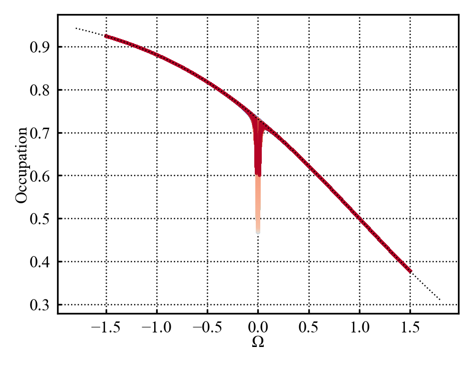{}

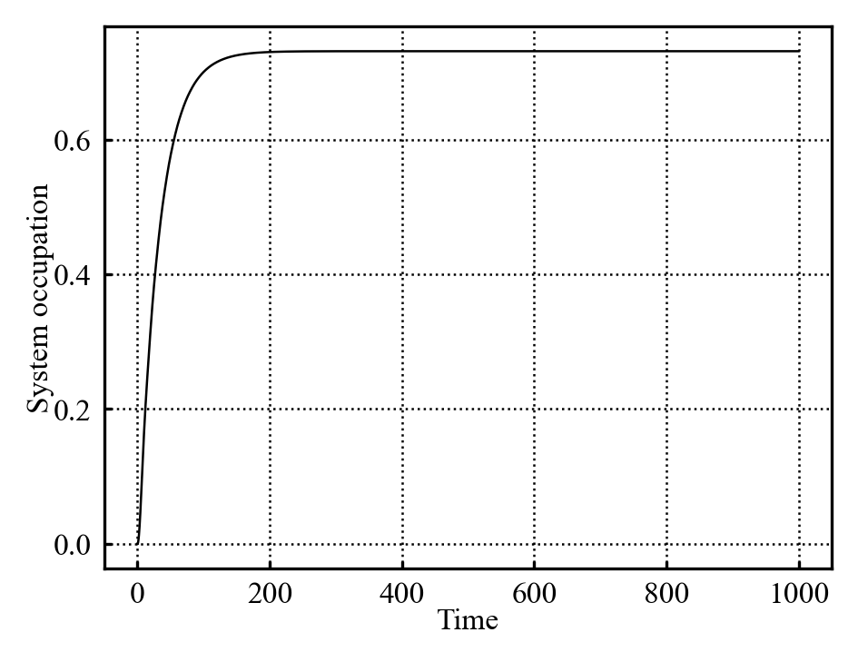{}

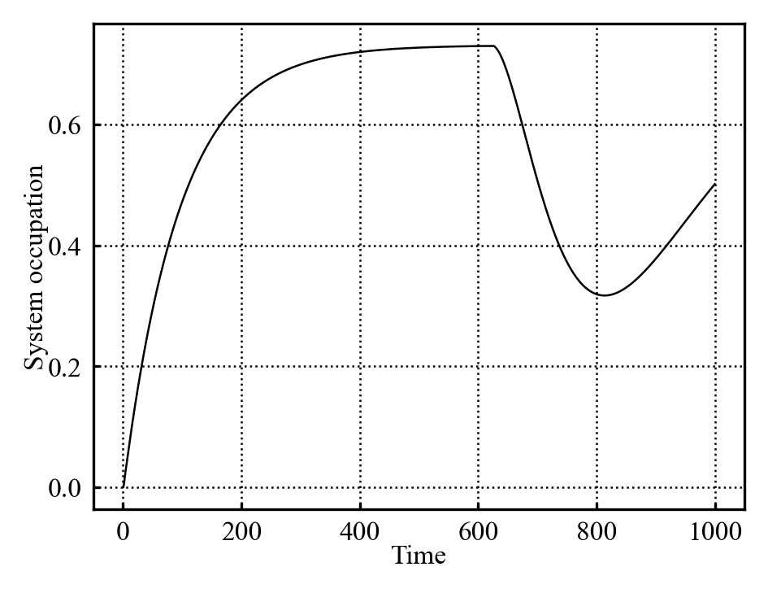{}

Bandwidth variation: Bath and system occupations (top and bottom) for $D=0.5, 1.5$ (left and right)
:::

Examining @fig-bandwidthVariation, the most dramatic observation is the difference in dethermalization time. For small $D$, the system thermalizes quickly and doesn't dethermalize over the simulation. Contrast this to large $D$ where the system dethermalizes and exhibits some nearly periodic behaviour after dethermalization. They both seem to thermalize to the same $n_{sys} \approx 0.7$ point. 

:::{#fig-bathsizeVariation layout-ncol=2 layout-nrow=2}

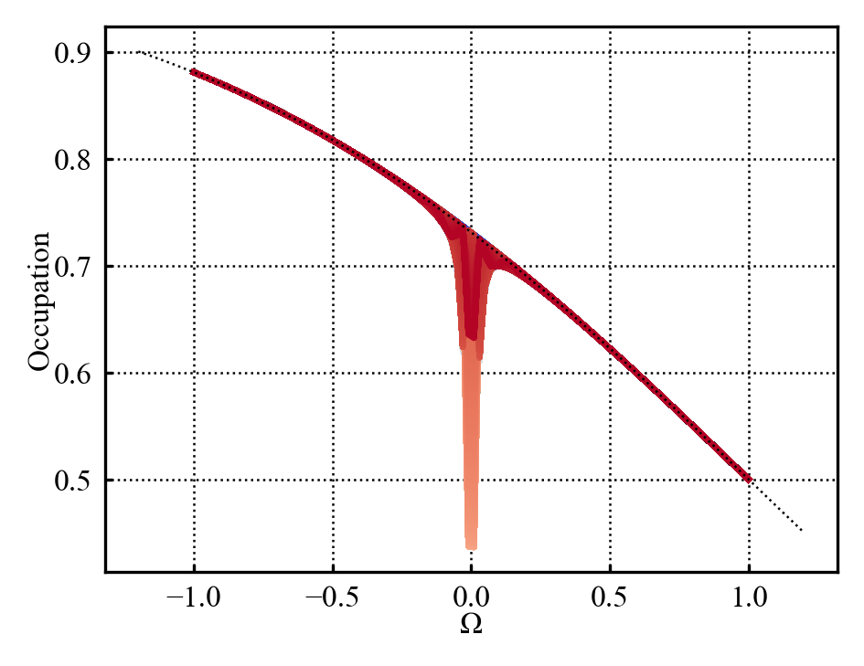{}

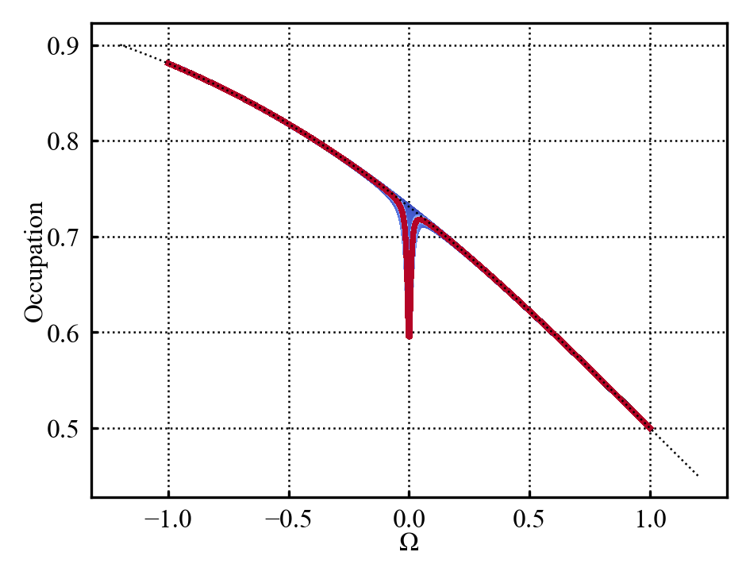{}

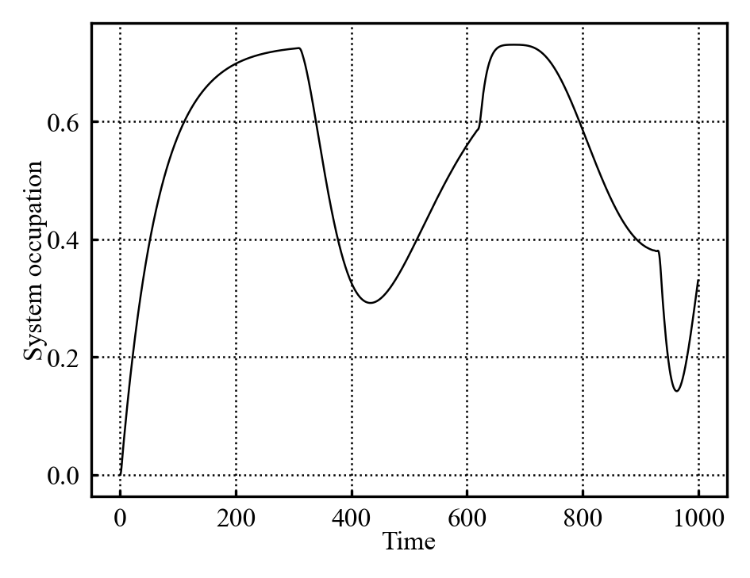{}

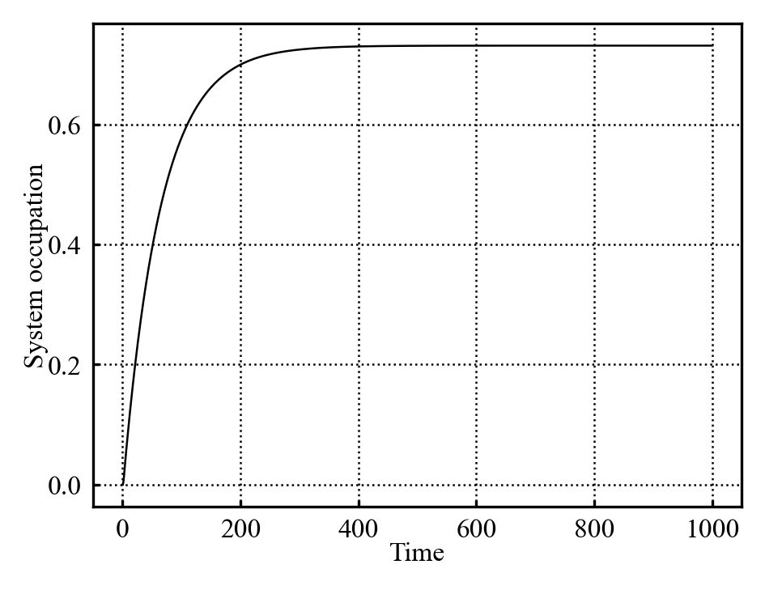{}

Bath size variation: Bath and system occupations (top and bottom) for $n=100, 400$ (left and right)
:::

Examining @fig-bathsizeVariation, a similarly dramatic difference in dethermalization becomes apparent. the small $n$ system dethermalizes dramatically and proceeds to fluctuate wildly 
(yet seemingly continuously) for the remaining runtime, never rethermalizing. Presumably this is due to a thermodynamic limit argument - thermalization w/a bath occurs due to the system coupling with a narrow average value of the bath instead of to all the elements in the bath. The detail of the bath elements is overshadowed by the average behaviour of many elements. However for smaller $n$, this thermodynamic limit doesn't apply, reducing the average behaviour, resulting in unpredictable contributions due to individual bath elements (this is a poorly rambled explanation, but will do for now).
What is interesting to note, is that the dethermalization in @fig-prefactorVariation, @fig-bandwidthVariation seem qualitatively similar to the start of this chaotic dethermalized process. Presumably this dethermalization is thus due to the finite nature of the simulation, with the small $n$ merely highlighting this behaviour earlier due to its particularly small bath. 

::: {.column-margin}
Sidenote: The dethermalizing behaviour exhibited here gives me some tangential thoughts on memory effects. I'm not yet well versed in the definitions of memory, however an idea which feels related is "given a point $n_{sys}(t)$ and its instantaneous derivatives for some unknown time $t$, can you find that time $t$?". Because for the thermalized state $n_{sys}$ and its derivatives are fairly constant over a wide range of $t$, so the exact $t$ may not be retrievable (given some measurement error). However given this unthermalizing behaviour, there appears to be a lot of variability such that a point $n_{sys}$ and its derivatives could be traced back to a unique $t$. Idk why this makes me think of memory effects; i'm likely just not yet well read up on the subject; however its an observation worth noting.
:::

:::{#fig-energyScaleVariation layout-ncol=2 layout-nrow=2}

{}

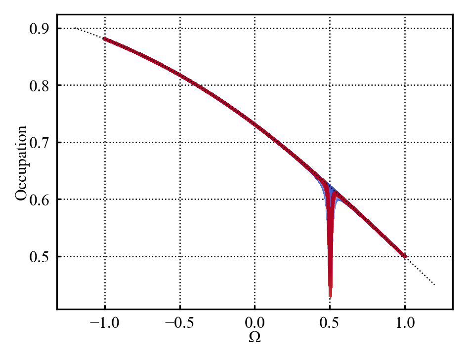{}

{}

{}

Energy scale variation: Bath and system occupations (top and bottom) for $\epsilon=0, 0.5$ (left and right)
:::

Examining @fig-energyScaleVariation, the main trend to note is a shift in the dip in the bath occupation plot from $\omega=0$ to $\omega=0.5$. This is explained by the shift in the system energy, as the system will "steal" occupation from the bath at a comparable energy which is presumably energetically favourable.

:::{#fig-betaVariation layout-ncol=2 layout-nrow=2}

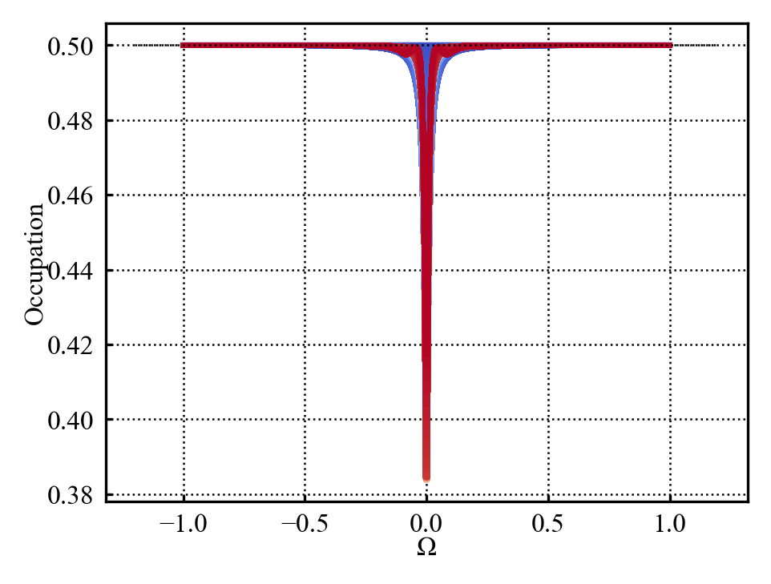{}

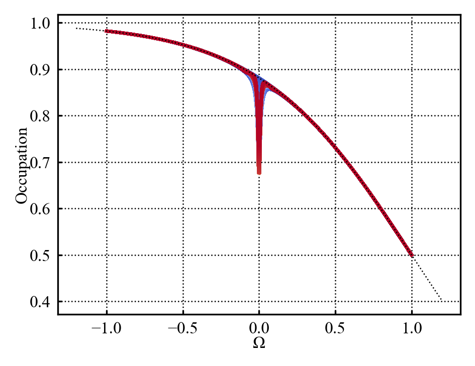{}

{}

{}

Temperature variation: Bath and system occupations (top and bottom) for $\beta=0, 2$ (left and right)
:::

@fig-betaVariation varies the temperature from a high temperature low $beta$ to a low temperature high $beta$ value. This shifts the distribution of the bath in line with the Fermi-Dirac distribution. Interestingly, it also shift $n_{sys}$, with the high temperature limit reducing $n_{sys}\approx 0.5$ whilst the low temperature limit increases $n_{sys} \approx 0.9$. This makes some intuitive sense; higher temperatures would provide the system with thermal energy to hop more frequently, whilst a lower temperature would almost "freeze" the system in a higher occupation. 
This does also introduce the question of system entropy and wether some idea of "system/bath phase" is applicable. My immediate instinct is that this setup shouldn't see any phase trasition; as in [@ProjectOutline2026], the system can be remapped onto a 1D chain w/nearest neighbour interactions. Borrowing intuition from 1D ising models where the dimensionality of that setup results in no phase transition as finite temperature, my (non rigorous) instinct would be that no phase transition should occur in this quantum setup due to that ~ one dimensionality. Have run another simulations with higher $beta$ just to double check this intuition. Non rigorously speculating and translating this 1D ising model intuition to the present setup; there should be a an ordered phase at $T=0$. My guess of what this would entail in this quantum setup is a phase where the particle "freezes" into the system, such that $n_{sys}=1$. Conversly for $T\to\infty$, a maximally disordered state should occur where the particle can be in any of the bath or system sites at random. Given that each bath site only couples to the bath site, my assumption would be that the bath occupation would still be quite high, since for the particle to hop between different bath sites requires a transfer through the system. This seems to be borne out by @fig-betaVariation where for $\beta=0$ $n_{sys} \approx 0.5$.

Additional simulations finished yielding @fig-betaAdditionalVariation. 

:::{#fig-betaAdditionalVariation layout-ncol=2 layout-nrow=2}

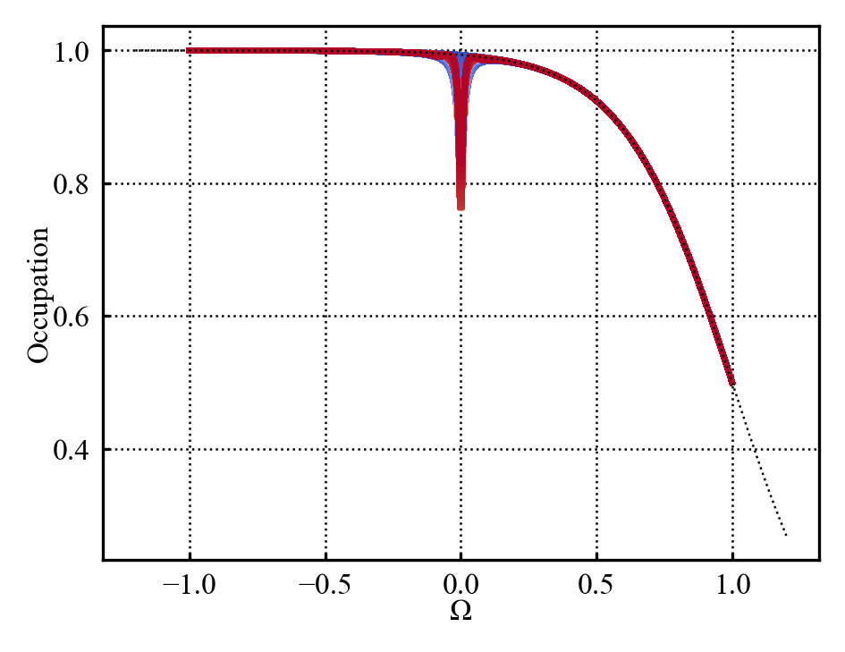{}

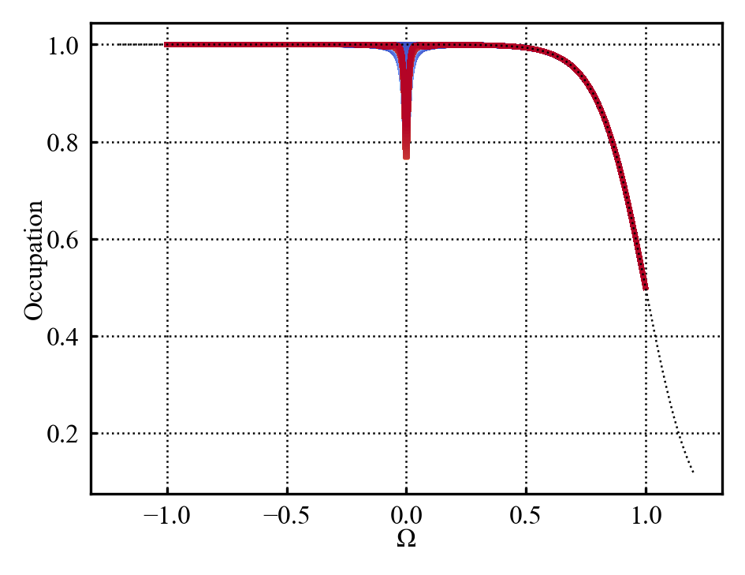{}

{}

{}

Additional temperature variation: Bath and system occupations (top and bottom) for $\beta=5, 10$ (left and right)
:::

Which seem to indicate a thermalized $n_{sys}=1$ for low $T$, in line with this "freezing" idea. 
Visually examining the plots over $\beta$, there doesn't appear to be any discontinous shift in either the system or bath occupation for finite $T$, so I don't think that there are any phase shifts at finite temperature for this system. I'm unsure if the 1D ising model analogy is sound, however if it is, classical criticality may provide useful analogues or insights into this system's behaviour. 

:::{#fig-muVariation layout-ncol=2 layout-nrow=2}

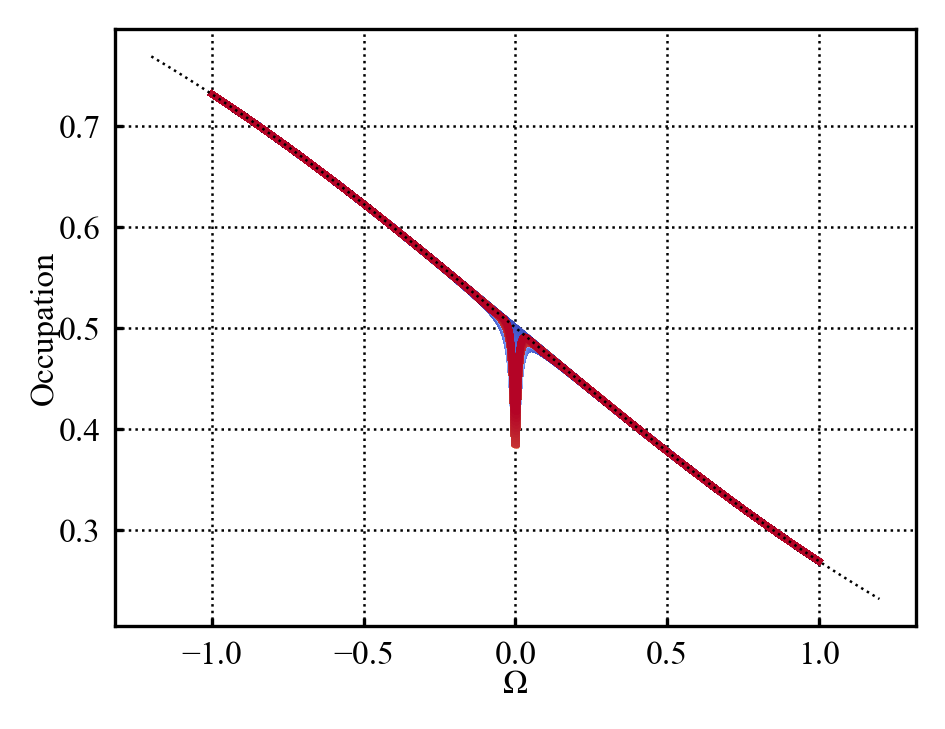{}

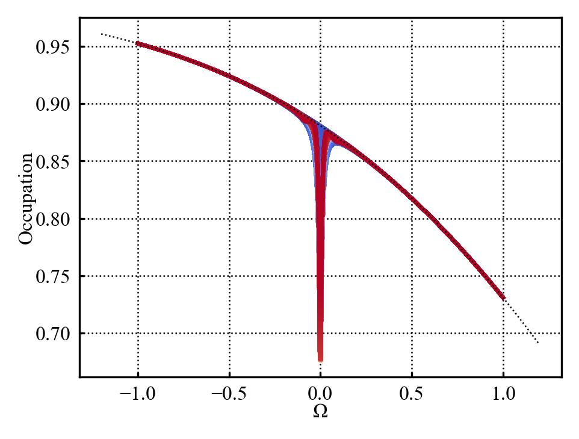{}

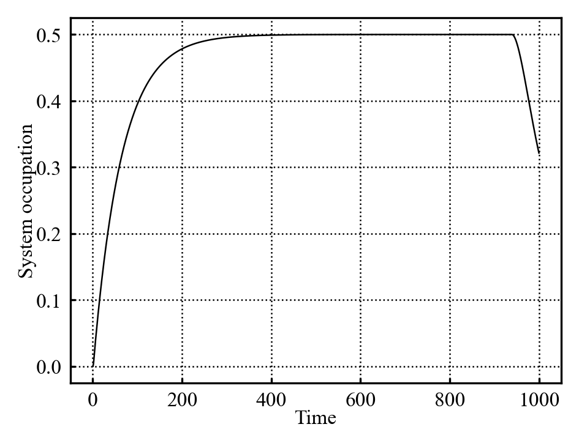{}

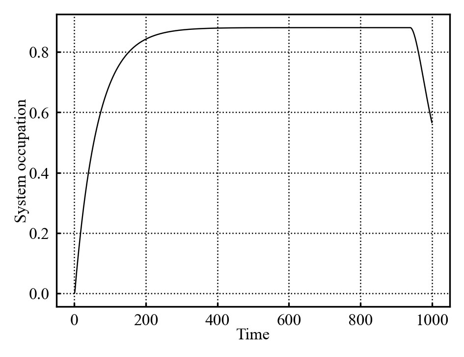{}

Chemical potential variation: Bath and system occupations (top and bottom) for $\mu=0, 2$ (left and right)
:::

The chemical potential variations in @fig-muVariation seem roughly analagous to the trends in $\beta$ variation in @fig-betaVariation, @fig-betaAdditionalVariation. This makes sense given their reciprocal role in the Fermi Dirac distribution; however its a nice confirmation.

Summarizing the apparent trends in these initial variations:

* The system occupation $n_{sys}$ starts low then rapidly thermalizes towards a thermalized point. 
* After this thermalized point, the system dethermalizes, presumably due to the finite nature of the bath, with unpredictable (yet seemingly continuous) behaviour following
* The bath occupation follows fermi dirac statistics except for a "dip" centered around the system energy - this can non rigourously be thought of as the system "stealing" occupation 
* there seems to be non finite "phases" to the system w/"frozen" $n_{sys}(T=0)=1$ and "disordered" $n_{sys}(T\to\infty)=0.5$ - I speculate that this may be analagous to the lack of finite temperature phase transitions in the 1D ising model - given that chain mapping allows this problem to be remapped to 1D, there may by some analagous phase behaviour as a result of the 1D setup. This is speculation however

Additionally note these tests were performed for the same semi-circle spectral function - other spectral functions will likely have differing behaviours.

### Reading notes [@RLMoccupation2026]:
Reading through the thermalization maths David sent me.
Derivation starts w/same hamiltonian and spectral function expressed more generally:

$$
\hat{H} = \epsilon \hat{s}^{\dagger}\hat{s} + \sum_{k=1}^{N}g_{k}(\hat{b}_{k}^{\dagger}\hat{s}+\hat{b}_{k}\hat{s}^{\dagger}) + \sum_{k=1}^{N}
$${#eq-hamiltonian}

$$
J(\omega) = \sum_{k=1}^{N} |g_{k}|^{2}\delta(\omega - \omega_{k})
$${#eq-generalSpectralFunction}

using properties of the dirac delta distribution, it follows that:

$$
\sum_{k=1}^{N} |g_{k}|^{2} F(\omega_{k}) = \int d\omega J(\omega) F(\omega)
$$

In Heisenberg picture, operators are expressed as:

::: {.column-margin}
Sidenote: if i recall correctly on my own background knowledge; 2 general pictures of QM depending on wether time dependence is incorporated into state $\hat{O}\ket{\psi(t)}$ or into operator $\hat{O(t)}\ket{\psi}$. The former is the Schrodinger picture, the latter the Heisenberg picture; with a weird mismash of the 2 being the interaction picture (wether time dependence is incorporated into the operator or state depends on wether it represents the non interacting or interacting bits of the hamiltonian))
:::

$$
\hat{O(t)} = \hat(U)(t)\hat{O}\hat(U)^{\dagger}(t)
$${#eq-heisenbergOperator}

which yields Heisenberg's eq which describes QM time evolution alternatively to Schrodinger's eq:

$$
i\frac{d\hat{O(t)}}{dt}=[\hat{O(t)},\hat{H}]
$${#eq-heisenbergEq}

Obeying fermionic anticommutations: 

$$
\{\hat{s},\hat{s}^{\dagger}\}=1 \ \ \ \ \{\hat{b_{k}},\hat{b_{q}}^{\dagger}\}=\delta_{kq} \ \ \ \ \{\hat{s},\hat{b_{k}}\}=\{\hat{s},\hat{b_{k}}^{\dagger}\}=\{\hat{b_{k}},\hat{b_{q}}\}=0
$${#eq-fermionicAnticommutations}

A useful identity for evaluating the fermion creator/annihalator operators in @eq-hamiltonian in terms of anti commutations instead of commutators follows:

$$
[\hat{A}, \hat{B}\hat{C}] = \{\hat{A}, \hat{B}\} \hat{C} - \hat{B}\{\hat{A}, \hat{C}\}
$${#eq-commutatorAnticommutatorIdentity}

Applying @eq-commutatorAnticommutatorIdentity to all the terms in @eq-generalSpectralFunction yields:

$$
[\hat{s},\hat{H}] = \epsilon \hat{s}+\sum_{q}g_{q}\hat{b_{q}}
$${#eq-sHcommutator}

$$
[\hat{b_{q}},\hat{H}] = \omega \hat{b_{q}}+g_{k}\hat{s}
$${#eq-bHcommutator}

Applying these to @eq-heisenbergEq yields the system specific Eqs of motion:

$$
i\dot{\hat{s}} = \epsilon \hat{s}+\sum_{q}g_{q}\hat{b_{q}}
$${#eq-motionS}

$$
i\dot{\hat{b_{k}}} = \omega \hat{b_{q}}+g_{k}\hat{s}
$${#eq-motionB}

Since these are linear, they are analytically solvable.

Apparently the approach involves solving @eq-motionB for $\hat{b_k(t)}$ which can then be subbed into @eq-motionS for an exact solution.
Skipping over some steps (which looks like a fourier transform), $\hat{b_k(t)}$ follows as:

$$
\hat{b_k(t)} = \hat{b_k(t_{0})}e^{-i\omega_{k}(t-t_0)} - ig_{k}\int_{t_0}^{t}dt'e^{-i\omega_{k}(t-t_0)}\hat{s(t')}
$${#eq-motionBsol}

@eq-motionS is expressed in terms of a $\sum_{q}g_{q}\hat{b_{q}}$ term; so @eq-motionBsol becomes:

$$
\sum_{q}g_{q}\hat{b_{q}} = \hat{\xi(t)}-i \int_{t_{0}}^{t}dt'K(t-t')\hat{s(t')} 
$$

$$
\hat{\xi(t)} = \sum_{k} g_{k}\hat{b_{k}(t_{0})e^{-i\omega_{k}(t-t_0)}} 
$$

$$
K(t-t') = \sum_{k}|g_{k}|^2e^{-i\omega_{k}(t-t_0)} = \int d\omega J(\omega)e^{-i\omega_{k}(t-t_0)}
$$

so @eq-motionS becomes:

$$
i\dot{\hat{s}} = \epsilon \hat{s}+\hat{\xi(t)}-i\int_{t_{0}}^{t}dt'K(t-t')\hat{s(t')}
$$

This is apparently fiddly to solve (which i believe), the main utility is once having an expression for $\hat{s(t)}$, we can take the $\lim_{t\to\infty}$ to determine the thermalized occupancy which follows:

$$
n_{sys} = \int \frac{d\omega}{2\pi}A(\omega)f(\omega)
$${#eq-analyticalNsys}

$$
A(\omega) = \frac{2\pi J(\omega)}{(\omega-\epsilon-\Lambda(\omega))^2+\pi^2J(\omega)^2}
$${#eq-analyticalA}

$$
\Lambda(\omega) = \mathcal{P}\int d\omega \frac{J(\omega')}{\omega - \omega'}
$${#eq-analyticalLambda}

There are a few things i'm unsure of with these final expressions:

* What does $f(\omega)$ represent
* What does $\mathcal{P}$ represent
* What are the integration bounds in @eq-analyticalLambda - i'm assuming its the bandwidth but not 100% sure

Assuming that $\mathcal{P}$ is just some easy to plug in constant and the integral bounds are the bandwidth; i suspect the sympy library can handle @eq-analyticalLambda and @eq-analyticalA for arbitrary $J(\omega)$. Plugging it into existing code will require either some spaghetti connections between the lambda function spectral function and sympy expressions, or a rewrite of how the spectral function is stored in terms of sympy expressions; however both are trivial technical tasks.

Wether sympy can handle @eq-analyticalNsys depends on $f(\omega)$. However if its a reasonably well behaved function that is plugged into @eq-analyticalNsys w/out fuss, then sympy SHOULD be able to handle all of that, and compute analytical expressions for @eq-analyticalNsys given arbitrary $J(\omega)$ which would be convenient. Would be worth testing however; ik the sympy integrators can be fickle, so worth testing that it can handle these integrals at least for the base case of a semicircular $J(\omega)$ before committing time  towards accomodating sympy in the code. 

However if that can be done, implementing the analytical thermalization for this problem shouldn't take more than a day i think.

Assuming that can be done, it'd be possible to compare simulated $n_{sys}$ to analytical thermalization - this could be interesting on it's own, but could also be used to curtail the simulation once it's thermalizes (assuming that thermalization process and thermalized state are the only things of interest and that we're not interested in the dethermalization).
