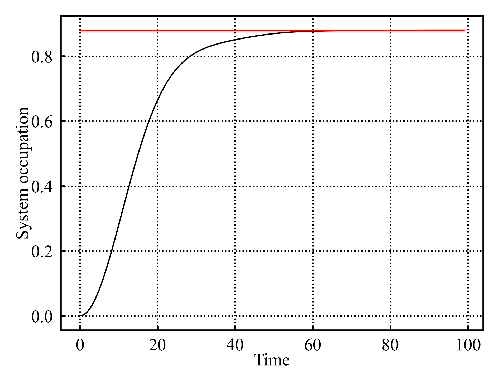
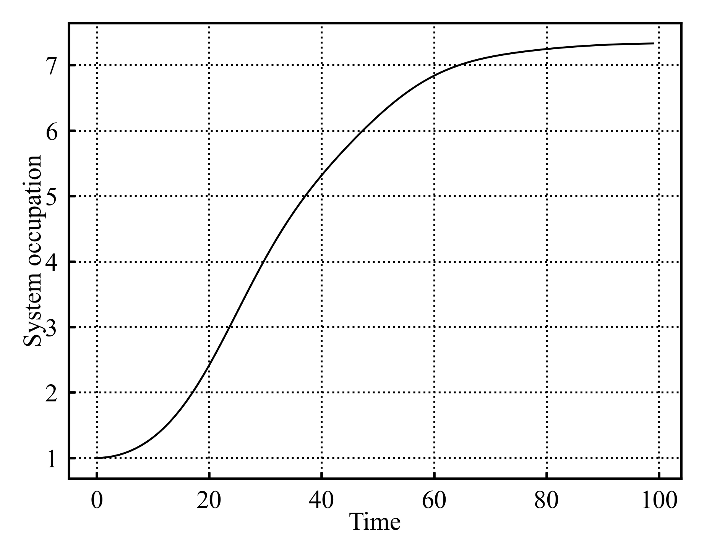
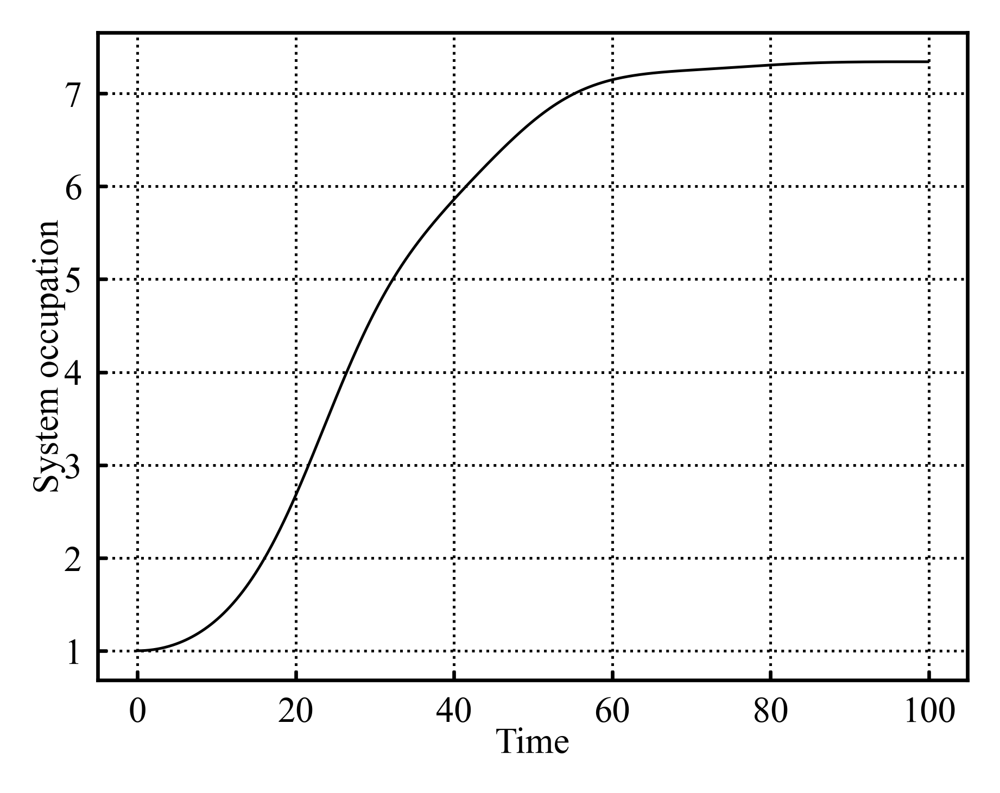
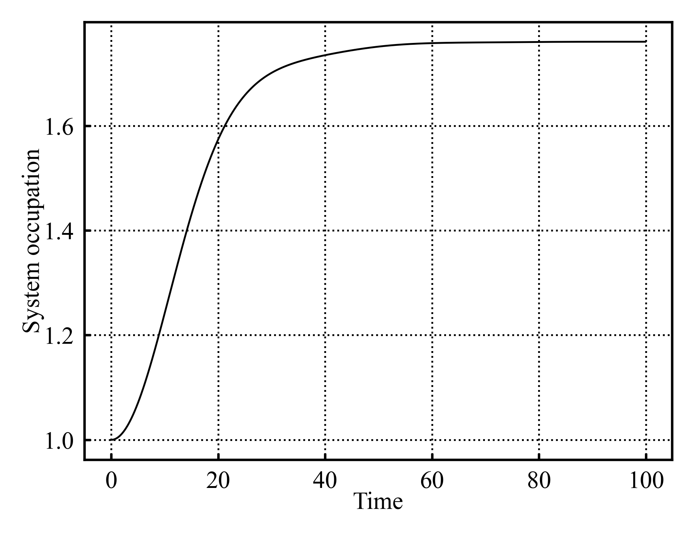
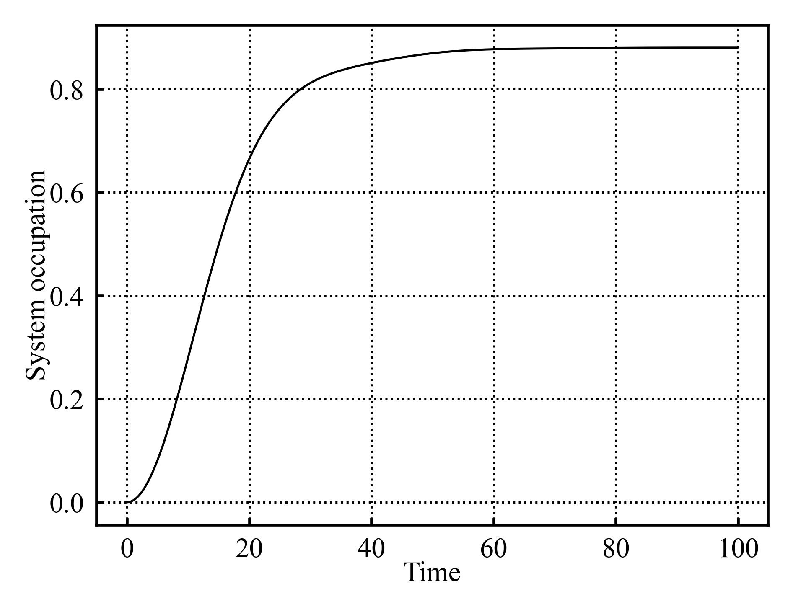
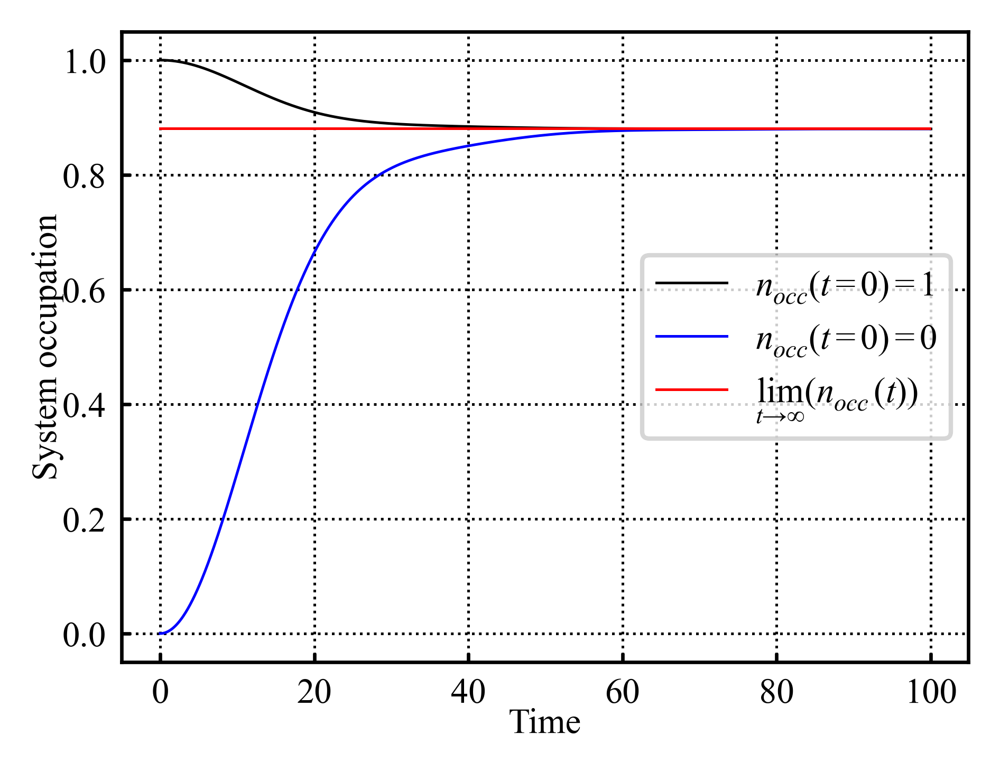

## 05/10/2026
Continuing on with the analytical thermalization implementation.
Have finished implementing the analytical thermalization into it's own little object. It is able to produce the expected system occupation, as well as plot $A(\omega)$. The simulation object generates a thermalization object such that it can compare the analytical vs numeric thermalization on the plot (as in @fig-Aomega, @fig-numericVsAnalyticalThermalization)

{#fig-Aomega} 

{#fig-numericVsAnalyticalThermalization} 

That took significantly longer than I would have liked; trying for symbolic automation of that integral was a poor idea. 

Have also quickly setup the bones of the dual simulation system. Idk yet how to extract the dynamical map, but know that it will involve 2sims, 1 w/system starting occupied, the other w/unoccupied system. SO have setup a class that contains and runs and occupied and occupied simulation alongside basic utilities for it.

## 06/10/2026
Starting to look at the dynamical map; David has updated [@ProjectOutline2026] with a quick outline.

### Reading notes: Dynamical map extraction [@ProjectOutline2026]
Because the simple model we're using only allows the system to be in a $\ket{0}$, or $\ket{1}$ state, we expect the dynamical map to be a 2x2 matrix of form:

$$
\hat{\Lambda(t)} = \begin{bmatrix}
\nu & \sigma \\
\alpha & \beta
\end{bmatrix}
$${#eq-mapForm}

Considering it's action on some state of occupation $p$ $\ket{\psi}=\begin{bmatrix}1-p \\ p\end{bmatrix}$ and enforcing trace preservation yields:

$$
\hat{\Lambda(t)}\ket{\psi} =  \begin{bmatrix}\nu(1-p)+\sigma p \\ \alpha(1-p)+\beta p \end{bmatrix}
$${#eq-dynamicalMapOnState}

$$
\downarrow
$$

$$
\nu(1-p)+\sigma p+\alpha(1-p)+\beta p=1 
$$

$$
(\nu+\alpha)+(\sigma+\beta-nu-\alpha)p = 1
$$

which can only hold $\forall p$ if:

$$
\hat{\Lambda(t)} = \begin{bmatrix}
\nu & \sigma \\
1-\nu & 1-\sigma
\end{bmatrix}
$${#eq-lambdaForm}

Need to ensure "positivity" (unsure as to exactly why, but will roll w/it). @eq-dynamicalMapOnState maps initial occupation $p$ to a new occupation $p^{*}=\nu(1-p)+\sigma p = \alpha(1-p)+\beta p$. Oh i see why positivity; $p^{*}$ represents an occupation probability; negative values are nonsensical ergo $p^{*}\in[0,1]$ is a useful condition. Expressing $p^{*}=C_{11}(t)$ where $C$ is the correlation matrix directly links the dynamical map s.t:

$$
C_{11}(t)= \begin{cases}1-\nu & C_{11}(0)=0=\textit{occupied} \\
\nu-\sigma & C_{11}(0)=1=\textit{unoccupied} \end{cases}
$${#eq-dynamicalMapCorrelationRelation}

Therefore:

$$
\hat{\Lambda(t)} = \begin{bmatrix}
1-C_{occ}(t) & 1-C_{occ}(t)-C_{unocc}(t) \\
C_{occ}(t) & C_{occ}(t)+C_{unocc}(t)
\end{bmatrix}
$${#eq-mapCorrelationForm}

where $C_{occ}(t)=C_{11}(t)$ for the initially occupied state,  $C_{unocc}(t)=C_{11}(t)$ for the initially unoccupied state.

It is a touch unclear to me over which $t$ $C_{11}(t)$ needs to be measured. My naive assumption is that it needs to be defined over all $t$ of interest; so simulate till thermalization and then $\Lambda(t)$ encapsulates the dynamics over that time range. If so, the dynamical map would probably be stored as either a time-instantaneous dynamical map dictionary, or in an array. Far less storage required compared to the full correlation matrix (besides which the dynamical map is the primary object of analysis for later).

But assuming i'm correct, then implementing the dynamical map should simply be a matter of querying $C_{11}(t)$ for the occupied and unoccupied simulations respectively, and inputting those values into @eq-mapCorrelationForm.


Have added some empty functions and code comments to the dual sim object; nothing functional yet, just systems that will support this dynamical map extraction and use.


## 07/10/2026
Had supervisor meeting:

* Explained what i had done thus far
* Briefly discussed presentation:
	* Short explanation of what my project is and what the plan is
	* 1st slide, explain general research area
	* 2nd slide, explain specific problem and questions
	* explain general methods and background
	* show current results
	* outline plan
	* Note to self: is to a large degree pedagogical exercise; need to explain topic to unfamiliar peers; if they understand overview of what i'm doing, that's a win

* Note: can get system occupation from dynamical map; plotting this may be useful gut check to ensure everything is working

* Short-mid term plan:
	* Implement dynamical map into code
	* Implement memory kernel as first measure of non markovianity
	* Do more literature reading - I've spent a lot of time implementing a solid technical foundation for the project, but have spent comparatively little time delving into the literature and the theory
	* prep for presentation

* Provided additional papers; 
	*[@memoryKernelOutline2014] should outline the memory kernel stuff, 
	* [@analyticalTransferTensor2026] may provide useful comparison of numerical kernel and analytical limit. This latter paper should provide insight into the subtleties and potential pitfalls if i don't treat this carefully

Consolidating the plan for the foreseable, i think it follows:

* Short term (pre presentation):
	* Wk of 05/10/2026: Implement dynamical map, implement plotting and analytical utilities for it in order to gut check it generally - maybe polish some of the plotting utilities to make them more flexible for later subplotting
	* Wk of 12/10/2026: Implement memory kernels and use it as case study to help guide literature deep dive
	* Wk of 19/10/2026: Block week out to work on presentation
	* Wk of 26/10/2026: Presentation slides are due this Wk - can take some time to practice presentation
	* Wk of 02/11/2026: Presentations occur
* Mid-long term (post presentation):
	* Finish off literature deep dive - this should give me a firm conceptual framework for the topic area and the different measures of non markovianity
	* Implement other memory definitions
	* Compare memory definitions on current setup
	* Figure out next steps w/insight gained at this point

## 09/10/2026
Have quickly implemented computing the dynamical map. Also implementing a "compute state from dynamical map" method which takes in an initial occupation probability, and evolves it using the dynamical map. Have also implemented a quick system plotting function which can plot this occupation over time. It doesn't match the basic simulation evolution; likely a typo somewhere in the maths.

hmmm, something odd is occuring.

{#fig-refEvo} 

::: {#fig-dynamicalEvoBroken layout-ncol=2}





System evolution from occupied state propagated by dynamical map for $\Delta t=1, 0.1$ respectively
:::

Comparing a standard simulation @fig-refEvo to the dynamical map propagated occupation @fig-dynamicalEvoBroken reveals some issues. The dynamical map evolution is clearly distinct in its scale ($n_{occ} \in [0,8]$ vs $n_{occ} \in[0,1]$ for dynamic and simulation derived occupations), as well as thermalizing slower. But further than that, the timestep seems to have an effect on the dynamical map derived occupation evolution. 

Have quickly implemented unitary check for the dynamical map. Aaaand it isn't unitary; smth is wrong.
Ok have removed one error; new evolution for dynamical map yields @fig-dynamicalMap2.

{#fig-dynamicalMap2} 

This is still of the wrong scale, but is at least the right shape on first inspection.
Quickly summarising what the code was doing:


$$\ket{\psi(0)} = \begin{bmatrix}0 \\ 1 \end{bmatrix}$$
$$\ket{\psi(t)} = \Lambda(t)\cdot\ket{\psi(t-\Delta t)}$$

the fix switched it to:

$$\ket{\psi(t)} = \Lambda(t)\cdot\ket{\psi(0)}$$

The dynamical map at every steps applies to the initial state; not the previous state; which was causing issues. Its still not of the right magnitude which i suspect is due to the non unitary $\Lambda(t)$. It almost seems that a multiplication by 2 is occuring somewhere...

None of the dynamical maps are unitary for any time t.

Quickly checking some of the maths:


$$
\hat{\Lambda(t)} \cdot \hat{\Lambda(t)}^{\dagger}= \begin{bmatrix}
\nu & \sigma \\
1-\nu & 1-\sigma
\end{bmatrix} \cdot
\begin{bmatrix}
\nu^{\dagger} & (1-\nu)^{^{\dagger}} \\
\sigma^{\dagger} & (1-\sigma)^{\dagger}
\end{bmatrix} = \begin{bmatrix}
\nu & \sigma \\
1-\nu & 1-\sigma
\end{bmatrix} \cdot
\begin{bmatrix}
\nu^{\dagger} & 1-\nu^{^{\dagger}} \\
\sigma^{\dagger} & 1-\sigma^{\dagger}
\end{bmatrix}= \begin{bmatrix}
2 & \nu+\sigma-2 \\
\nu^{\dagger}+\sigma^{\dagger}-2 & 2
\end{bmatrix}
$${#eq-checkingLambdaUnitarity}

If i haven't done my maths wrong; the expression @eq-lambdaForm isn't unitary as in @eq-checkingLambdaUnitarity? I wouldn't bet against my doing the maths wrong; i am quite tired now and pen and papering the above...
Which i think is a good sign to put this away for now. Tmr i can recheck the maths with better focus.

## 10/10/2026
Have quickly double checked the above maths @eq-checkingLambdaUnitarity using sympy:

```
>>> import sympy

>>> v, o = sympy.symbols('v o')
>>> lambdaMatrix = sympy.matrices.Matrix([[v,o],[1-v,1-o]])
>>> conjugateMatrix = lambdaMatrix.H
>>> outputMatrix = sympy.simplify(lambdaMatrix * conjugateMatrix)
>>> print(sympy.latex(lambdaMatrix), "\cdot", sympy.latex(conjugateMatrix),"=", sympy.latex(outputMatrix))
```

::: {.column-margin}
Notation; when sympy exports to latex; it denotes conjugate using $\overline{x}$ instead of $x^{\dagger}$
:::

$$
\left[\begin{matrix}u & \sigma\\1 - u & 1 - \sigma\end{matrix}\right] \cdot \left[\begin{matrix}\overline{u} & 1 - \overline{u}\\\overline{\sigma} & 1 - \overline{\sigma}\end{matrix}\right] = \left[\begin{matrix}\sigma \overline{\sigma} + u \overline{u} & - \sigma \overline{\sigma} + \sigma - u \overline{u} + u\\- \left(\sigma - 1\right) \overline{\sigma} - \left(u - 1\right) \overline{u} & \left(\sigma - 1\right) \left(\overline{\sigma} - 1\right) + \left(u - 1\right) \left(\overline{u} - 1\right)\end{matrix}\right]
$${#eq-checkingLambdaUnitaritySympy}

Using sympy because its quite a flexible symbolic calculator, and I wanted to double check the pen and paper maths in @eq-checkingLambdaUnitarity.
@eq-checkingLambdaUnitaritySympy seems to be entirely equivilant to @eq-checkingLambdaUnitarity. If $\nu+\sigma=2$, $\nu, \sigma \in \mathcal{R}$, then $\Lambda\Lambda^{\dagger}=2I$ which is interesting because of the apparently $\times 2$ factor in @fig-dynamicalMap2 compared to @fig-refEvo.
Given @eq-dynamicalMapCorrelationRelation, $\nu+\sigma=2$ imply $2C_{occ}+C_{unocc}=0$. No idea what this would imply; but it feels rather arbitrary...

Redoing some of the maths:

$$
\hat{\Lambda(t)}\cdot\ket{\psi(t=0)} = \begin{bmatrix}
\nu & \sigma \\
1-\nu & 1-\sigma
\end{bmatrix}\cdot \begin{bmatrix} 1-p \\ p\end{bmatrix}=\begin{bmatrix}\nu(1-p)+\sigma p \\ (1-\nu)(1-p)+(1-\sigma)p\end{bmatrix} = \begin{bmatrix} 1-p^{*} \\ p^{*} \end{bmatrix}
$$

since $C_{11}(t)=n_{occ}$ it follows that $C_{11}(t)=p^{*}$ so:

$$
(1-\nu)(1-p)+(1-\sigma)p = C_{11}(t)
$${#eq-rederivedCorrelationRelation}

Since $\ket{\psi(p=0)}=(1-p)\ket{0}+p\ket{1}= \ket{0}$, $p=0$ implies an empty system, $p=1$ an occupied system; so @eq-rederivedCorrelationRelation becomes:

$$
C_{11}(t)= \begin{cases}1-\sigma & C_{11}(0)=0=\textit{occupied} \\
1-\nu & C_{11}(0)=1=\textit{unoccupied} \end{cases}
$${#eq-dynamicalMapCorrelationRelation2}

which differs to @eq-dynamicalMapCorrelationRelation and would imply:

$$
\hat{\Lambda(t)} = \begin{bmatrix}
1-C_{unocc}(t) & 1-C_{unocc}(t) \\
C_{unocc}(t) & C_{occ}(t)
\end{bmatrix}
$${#eq-mapCorrelationForm2}

{#fig-dynamicalMap3} 

Ok thats better; it seems the maths was misderived. @eq-mapCorrelationForm2 still isn't unitary seemingly; but is reproducing the correct dynamics.
Have tidied up some plotting utilities inc one which shows the system evolution from both occupied and unoccupied starting states:

{#fig-dynamicalMapDual}

The next steps require reading up on the different memory definitions. [@ProjectOutline2026] notes memory kernels, information backflow and failure of complete positivity. Going through and implementing these one by one may be wise. This would help me familiarize myself w/the theory in one context, which should hopefully yield enough insight to make understanding the other definitions easier.
As such, examining the memory kernels feels a decent place to start.

[@ProjectOutline2026] notes memory kernels are defined in terms of the Nakajima-Zwanzig formalism. [@OpenQuantumSystemsIntro2012] seems to have decent information on the topic, so will start there.

### Reading notes: [@OpenQuantumSystemsIntro2012]

Classical markovianity for context (p35) - stochastic processes w/Random variable $x(t)$ is markovian if the probability of $x_{n}, t_{n}$ is conditioned solely on the previous timestep s.t:

$$
p(x_{n}, t_{n}|x_{n-1}, t_{-1};...;x_{0}, t_{0})=p(x_{n}, t_{n}|x_{n-1})
$${#eq-discreeteClassicallyMarkovianity}

Taking a continuum limit yields:

$$
p(x,t;x',t')=p(x,t|x',t')p(x',t')
$$

Where $x', t'$ take the place of $x_{n-1}, t_{n-1}$ for some infintesimal step.
Integrating over $x'$ directly relates the two absolute probabilities:

$$
p(x,t)=\int dx' p(x,t|x',t')p(x',t') = \int dx' K(x,t|x',t')p(x',t') 
$$

Which is of similar form to the summary in [@ProjectOutline2026]; with $K$ being the memory kernel. This would make sense given that it literally represents the conditional probability of a given state $x,t$ given some prior state(s) $x', t'$. 

Sec 5.2 (p37) then outlines the specifics for quantum markovian evolution and its master eq. The key result of this section is the statement that QM markovian systems obey the Master equation:

$$
\frac{d\rho(t)}{dt} = -i[H(t),\rho(t)]+\sum_{k}\gamma_{k}(t)(V_{k}(t)\rho(t)V^{\dagger}_{k}(t)-\frac{1}{2}\{V_{k}(t)V^{\dagger}_{k}(t), \rho(t)\})
$${#eq-QMarkovianMasterEq}

Where $H(t)$ is hermitian, $\gamma_{k}(t)>0$. The section goes through the proof. Presumably $H(t)$ is the system hamiltonian, $\gamma_{k}(t)$ seemingly represent some eigenvalues; the meaning of $V_{k}$ isn't clear. Would need to look at the proof in more detail; as well as try to parse the fairly abstract terms therein to get some intuition to what these terms represent. Not an immediate now thing.

Sec 6.1 (p52) introduces the Nakajima-Zwanzig Eq (albeit presumably in a markovian context).
It sets up the hamiltonian:

$$
H = H_{a}+H_{b}+V
$${#eq-Nakajima-ZwanzigHamiltonian}

Where $H_{a}$ and $H_{b}$ are the independent hamiltonians of the system and bath, whilst $V$ represents the interaction between them (i wonder if this relates to the above $V_{k}$ terms?).
This results in a combined hilbert space $\mathcal{H}=\mathcal{H_{a}}\otimes\mathcal{H_{b}}$. It is apparently useful to define 2 orthogonal projection operators $\mathcal{P}, \mathcal{Q}$ s.t $\mathcal{P}^{2}=\mathcal{P}$, $\mathcal{Q}^{2}=\mathcal{Q}$, $\mathcal{P}\mathcal{Q}=\mathcal{Q}\mathcal{P}=0$ defined as:

$$
\mathcal{P}_{\rho} = Tr_{b}(\rho)\otimes\rho_{b}
$${#eq-Poperator}
$$
\mathcal{Q}_{\rho} = (\mathcal{I}-\mathcal{P}_{\rho})\rho
$${#eq-Qoperator}

The method sets $\rho_{b}$ to be the environments initial state as a convenience, and assumes initial thermal equilibrium s.t:

$$
\rho_{b} = e^{-\beta H_{b}}[Tr(e^{-\beta H_{b}})]^{-1}
$${#eq-rhoBinitial}

Inserting @eq-Nakajima-ZwanzigHamiltonian into the "Von Neuman Eq" yields:

::: {.column-margin}
From context the Von Neuman Eq is $\frac{d\rho(t)}{dt}=-i[H,\rho]$
:::

$$
\frac{d\rho(t)}{dt}=-i[H_{a}+H_{b}+V,\rho]
$${#eq-Nakajima-ZwanzigVonNeumanEq}

The method takes the projection operator on @eq-Nakajima-ZwanzigVonNeumanEq. Note that this method uses the interaction picture; so seperates out the system/enviroment and interaction terms by defining: 

$$
\rho'(t)=e^{i(H_{a}+H_{b})t}\rho(t)e^{-i(H_{a}+H_{b})t}
$$

For trace preservation reasons, the projector operators on @eq-Nakajima-ZwanzigVonNeumanEq can be written in this interaction picture as:

$$
\frac{d\mathcal{P}\rho'(t)}{dt}=-i\mathcal{P}[V,\rho']
$${#eq-Nakajima-ZwanzigVonNeumanEqPoperator}

$$
\frac{d\mathcal{Q}\rho'(t)}{dt}=-i\mathcal{Q}[V,\rho']
$${#eq-Nakajima-ZwanzigVonNeumanEqQoperator}

By redefining $\mathcal{V}(t)=-i[V,.]$, and taking several other steps, the generalized Nakajima-Zwanzig Eq results:

$$
\frac{d}{dt}\mathcal{P}\rho'(t) = \mathcal{P}\mathcal{V}(t)\mathcal{P}\rho'(t)+\mathcal{P}\mathcal{V}(t)\mathcal{G}(t,0)\mathcal{Q}\rho'(0)+\int_{0}^{t}dt'\mathcal{P}\mathcal{V}(t)\mathcal{G}(t,t')\mathcal{Q}\mathcal{V}(t')\mathcal{P}\rho'(t')
$${#eq-generalizedNakajima-ZwanzigEq}

$$
\mathcal{G}(t,t')=\mathcal{T}e^{\int_{t'}^{t} ds\mathcal{Q}\mathcal{V}(s)}
$$

Which is awful to look at. The paper notes 2 common assumptions; A) $\mathcal{P}\mathcal{V}(t)\mathcal{P}=0$, B) assuming initial state $\rho(0)=\rho_{a}(0)\otimes\rho_{b}(0)$ is a product state of A, B. This simplifies @eq-generalizedNakajima-ZwanzigEq to:

$$
\frac{d}{dt}\mathcal{P}\rho'(t) = \int_{0}^{t}dt'\mathcal{K}(t,t')\mathcal{P}\rho'(t')
$${#eq-simpleNakajima-ZwanzigEq}

$$
\mathcal{K}(t,t') = \mathcal{P}\mathcal{V}(t)\mathcal{G}(t,t')\mathcal{Q}\mathcal{V}(t')
$${#eq-Nakajima-ZwanzigEqKernel}

With @eq-simpleNakajima-ZwanzigEq being similar in form to the summary given by [@ProjectOutline2026]. Some differences are present; $\mathcal{P}$ isn't present, and the interaction $\rho'$ isn't acknowledged; i suspect that that may be simplified in this project, hence their absence.
Further note that kernel homogeneity is a condition s.t $\mathcal{K}(t,t')=\mathcal{K}(t-t')$ (which is also the form given by
[@ProjectOutline2026]) which is apparently solvable by laplace eq.

The paper continues in sec 6.2 (p56) and sec 6.3 (p75) by examining a weak coupling limit and a singular coupling limit respectively. These are both long and involved sections; and i'm not sure how relevant they may be. That said however, there are examples in sec 6.2.5 (p67) which look familiar. 

Sec 7 (p82) begins examining the non markovian case. Reiterates @eq-simpleNakajima-ZwanzigEq, noting that in the non markovian case; @eq-Nakajima-ZwanzigEqKernel is difficult to write s.t @eq-simpleNakajima-ZwanzigEq isn't necessarily solvable. It notes an additional step to try and reduce non markovian dynamics to markovian dynamics as:

$$
\frac{d\rho(t)}{dt}=\int_{0}^{t}dt'k(t-t')\mathcal{L}(\rho(t'))
$${#eq-Nakajima-ZwanzigMemoryForm}

Which almost exactly corresponds to that introduced by [@ProjectOutline2026], with $k(t-t')$ representing the memory effects w/$k(t-t')\to\delta(t-t')$ recovering markovian behaviour.

Note that [@ProjectOutline2026] expresses this as:

$$
\frac{d\rho(t)}{dt}=\int_{0}^{t}dt'k(t-t')\rho(t')
$${#eq-Nakajima-ZwanzigMemoryForm2}

With the idea being inverting this eq to extract $k(t-t')$. Not entirely sure how to do that yet since the integral is over a different $t'$ to $\rho(t)$...

Aside; but skimming over [@analyticalTransferTensor2026] seems to confirm my understanding acquired from the above reading; similar terms and logic poping up. Its not that papers main focus; but reassuring to note.

[@memoryKernelOutline2014] likewise has similar terms. Both papers refer to "transfer tensors" seemingly as discreete objects which relate to the kernels somehow. Both papers seem to be exploring a "transfer tensor method" to extract certain system parameters including the memory kernel.

[@scaryPaper2019] which compares multiple defs of quantum non markovianity (similarly to this project) has a section on memory kernels which echoes the same ideas as above. 


Thinking ahead; in order to extract memory kernels; i mostly need to figure out how to invert @eq-Nakajima-ZwanzigMemoryForm2; the density $\rho$ is known for all $t$; therefore it should just be a bit of calc; but unsure exactly how to do that given the different $t'$ integration variable... not a today problem; will come back to it tmr...