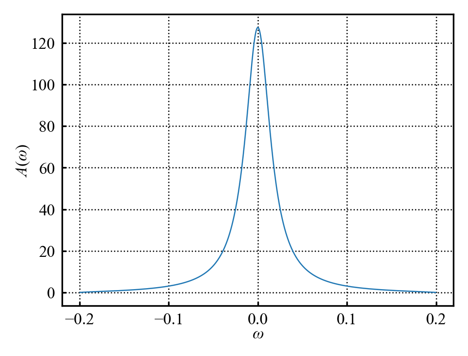
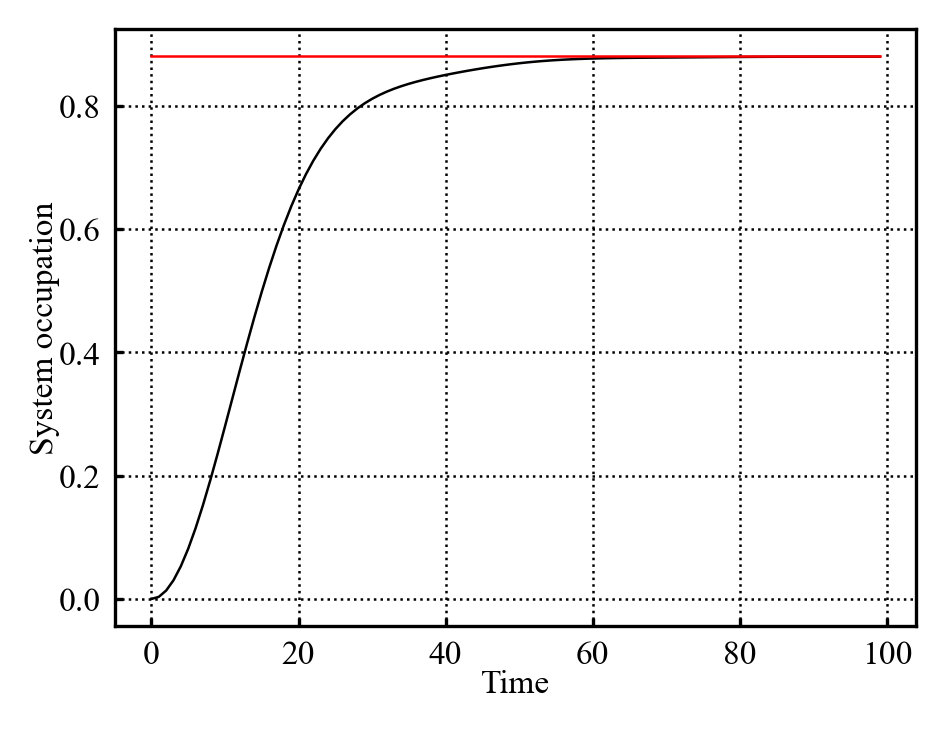

## 05/10/2026
Continuing on with the analytical thermalization implementation.
Have finished implementing the analytical thermalization into it's own little object. It is able to produce the expected system occupation, as well as plot $A(\omega)$. The simulation object generates a thermalization object such that it can compare the analytical vs numeric thermalization on the plot (as in @fig-Aomega, @fig-numericVsAnalyticalThermalization)

{#fig-Aomega} 

{#fig-numericVsAnalyticalThermalization} 

That took significantly longer than I would have liked; trying for symbolic automation of that integral was a poor idea. 

Have also quickly setup the bones of the dual simulation system. Idk yet how to extract the dynamical map, but know that it will involve 2sims, 1 w/system starting occupied, the other w/unoccupied system. SO have setup a class that contains and runs and occupied and occupied simulation alongside basic utilities for it.

## 06/10/2026
Starting to look at the dynamical map; David has updated [@ProjectOutline2026] with a quick outline.

### Reading notes: Dynamical map extraction [@ProjectOutline2026]
Because the simple model we're using only allows the system to be in a $\ket{0}$, or $\ket{1}$ state, we expect the dynamical map to be a 2x2 matrix of form:

$$
\hat{\Lambda(t)} = \begin{bmatrix}
\nu & \sigma \\
\alpha & \beta
\end{bmatrix}
$${#eq-mapForm}

Considering it's action on some state of occupation $p$ $\ket{\psi}=\begin{bmatrix}1-p \\ p\end{bmatrix}$ and enforcing trace preservation yields:

$$
\hat{\Lambda(t)}\ket{\psi} =  \begin{bmatrix}\nu(1-p)+\sigma p \\ \alpha(1-p)+\beta p \end{bmatrix}
$${#eq-dynamicalMapOnState}

$$
\downarrow
$$

$$
\nu(1-p)+\sigma p+\alpha(1-p)+\beta p=1 
$$

$$
(\nu+\alpha)+(\sigma+\beta-nu-\alpha)p = 1
$$

which can only hold $\forall p$ if:

$$
\hat{\Lambda(t)} = \begin{bmatrix}
\nu & \sigma \\
1-\nu & 1-\sigma
\end{bmatrix}
$$

Need to ensure "positivity" (unsure as to exactly why, but will roll w/it). @eq-dynamicalMapOnState maps initial occupation $p$ to a new occupation $p^{*}=\nu(1-p)+\sigma p = \alpha(1-p)+\beta p $. Oh i see why positivity; $p^{*}$ represents an occupation probability; negative values are nonsensical ergo $p^{*}\in[0,1]$ is a useful condition. Expressing $p^{*}=C_{11}(t)$ where $C$ is the correlation matrix directly links the dynamical map s.t:

$$
C_{11}(t)= \begin{cases}1-\nu & C_{11}(0)=0=\textit{occupied} \\
\nu-\sigma & C_{11}(0)=1=\textit{unoccupied} \end{cases}
$${#eq-dynamicalMapCorrelationRelation}

Therefore:

$$
\hat{\Lambda(t)} = \begin{bmatrix}
1-C_{occ}(t) & 1-C_{occ}(t)-C_{unocc}(t) \\
C_{occ}(t) & C_{occ}(t)+C_{unocc}(t)
\end{bmatrix}
$${#eq-mapCorrelationForm}

where $C_{occ}(t)=C_{11}(t)$ for the initially occupied state,  $C_{unocc}(t)=C_{11}(t)$ for the initially unoccupied state.

It is a touch unclear to me over which $t$ $C_{11}(t)$ needs to be measured. My naive assumption is that it needs to be defined over all $t$ of interest; so simulate till thermalization and then $\Lambda(t)$ encapsulates the dynamics over that time range. If so, the dynamical map would probably be stored as either a time-instantaneous dynamical map dictionary, or in an array. Far less storage required compared to the full correlation matrix (besides which the dynamical map is the primary object of analysis for later).

But assuming i'm correct, then implementing the dynamical map should simply be a matter of querying $C_{11}(t)$ for the occupied and unoccupied simulations respectively, and inputting those values into @eq-mapCorrelationForm.

Have added some empty functions and code comments to the dual sim object; nothing functional yet, just systems that will support this dynamical map extraction and use.